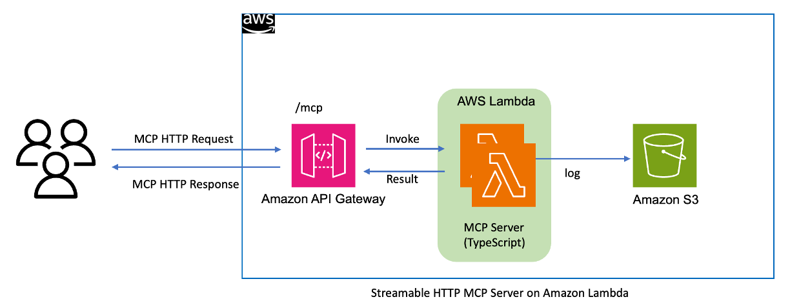

# sample-serverless-mcp-server

A Github MCP Server implementation based on Amazon Lambda and Streamable HTTP protocol.

## Project Description

This project demonstrates how to transform the official TypeScript MCP Server to support Streamable HTTP protocol and deploy it via Amazon Lambda. The implementation leverages new features introduced in MCP v2025.03.26, including:

- Stream transmission based on HTTP Chunked Transfer Encoding

- Dynamic context priority control

- Seamless integration with existing HTTP infrastructure


## Key Features

- Streamable HTTP  MCP protocol support

- Elastic deployment based on Amazon Lambda

- Optimized cost-performance balance

  

## MCP Server on Amazon Lambda Architecture



## Quick Start

### Prerequisites

- Node.js 20+
- AWS CLI configured
- OSS-Serverless CLI


### Serverless Streamable HTTP MCP Server

- Github MCP Server 


### How to deploy Github MCP Server on Amazon Lambda :

This project needs to set up a GITHUB_PERSONAL_ACCESS_TOKEN, which has been stored in Amazon Lambda environment variables. 

Never submit your serverless.yml to a GitHub public repository.

```bash
# Clone repository
git clone https://gitlab.aws.dev/wsuam/sample-serverless-mcp-server.git
cd sample-serverless-mcp-server/src/github/

# Install dependencies
npm install
npm install -g osls

#Set your github personal access token in serverless.yml 
cp serverless.example.yml serverless.yml
#edit serverless.yml , GITHUB_PERSONAL_ACCESS_TOKEN: <Your GitHub Personal Access Token>


# Test local
npm sls offline

# Deploy to AWS Lambda
npm sls deploy

```

## Architecture Overview

The project utilizes the following architecture:

- API Gateway: Handles HTTP requests

- Lambda: Executes MCP Server logic

- Streamable HTTP: Implements streaming responses

- DynamoDB and S3 store request logs (this part is not ready yet).

  

## Development Guide

1. Configure AWS credentials
2. Run `npm sls offline`
3. Follow the prompts to complete deployment configuration

## Contributing

Pull requests are welcome. Before submitting, please ensure:

- Code follows project standards
- All tests pass
- Documentation is updated

## License

This library is licensed under the MIT-0 License. See the LICENSE file.

## Project Status

Project is under active development. Issues and suggestions are welcome.

